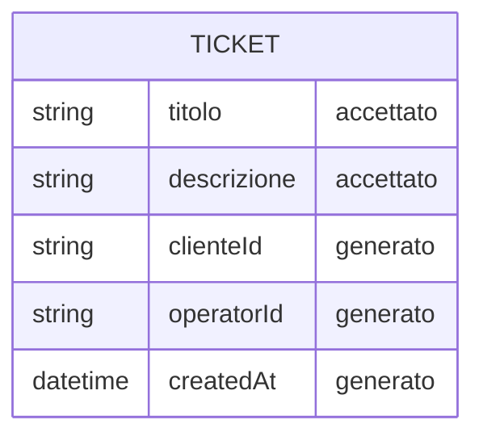

# Data Sketch - Create Ticket

## Prima Di Compilare

Un data sketch e' una classificazione dei campi prima dello schema definitivo.

Serve a decidere quali dati sono accettati, generati, respinti o ancora mancanti.

Il Mermaid finale visualizza solo campi e relazioni gia' motivati nella tabella.

Non usare questo file per progettare tutto il database o accettare campi non collegati a issue e contract.

## Come Scegliere Lo Stato Del Campo

| Stato | Usalo quando | Domanda di controllo |
| --- | --- | --- |
| accettato | il campo arriva dall'input e serve al primo slice | chi lo inserisce? |
| generato | il sistema crea il valore | quando viene creato? |
| respinto | il campo e' fuori scope o non motivato | quale vincolo lo esclude? |
| mancante | il campo potrebbe servire, ma manca una decisione | chi deve chiarirlo? |

Se non sai motivare un campo, non metterlo nel Mermaid: lascialo `mancante` o `respinto`.

## Scopo

Classificare i dati prima di chiedere codice.

## Campi

| Campo | Stato | Motivo | Fonte |
| --- | --- | --- | --- |
| `titolo` | accettato | Campo obbligatorio inserito dall'utente per identificare il problema, senza titolo il ticket non e' interpretabile dall'operatore | contract |
| `descrizione` | accettato | Campo obbligatorio inserito dall'utente per dettagliare il problema; senza descrizione l'operatore non ha contesto | contract |
| `clienteId` | generato | Identifica il cliente che ha aperto il ticket; necessario per attribuire il ticket a un utente reale | contract |
| `operatorId` | generato | Identifica l'operatore assegnato al ticket; necessario per l'assegnazione | contract |
| `createdAt` | generato | Timestamp di creazione assegnato dal sistema al momento del salvataggio | inferenza |

## Mermaid Leggero

Usa Mermaid solo per visualizzare la relazione minima. Non trasformarlo in schema DB definitivo.

Campi mostrati nel diagramma:

- titolo - accettato
- descrizione - accettato
- clienteId - generato
- operatorId - generato
- createdAt - generato

## Campi Scartati O Rimandati

| Campo | Decisione | Motivo |
| --- | --- | --- |
| priority | respinto | Non richiesto dalla issue L05 ne' dal contract sketch; nessuna evidenza che serva nel primo slice |
| area | respinto | Non richiesto dalla issue L05 ne' dal contract sketch; classificazione non prevista |
| attachments | respinto | La issue L05 esplicitamente vieta di aggiungere campi al ticket (non-goal) |
| owner | respinto | `clienteId` copre gia' la relazione di ownership del ticket |

